<div align="center">


<a href="#">
  
</a>

<br/>

[](https://www.python.org/)
[](https://streamlit.io/)
[](https://scikit-learn.org/)
[](https://www.mysql.com/)
[](#-bonus-chrome-extension)
[](LICENSE)

[](https://www.linkedin.com/in/jaindhruv1923)
[](mailto:jaindhruv1923@gmail.com)

**Built by [Dhruv Jain](https://github.com/jaindhruv1923/Project-Naukri-Saaf-Job-Listings-Analysis)** · B.Tech CSE (AI & Data Science), BML Munjal University

</div>

<br/>

## 📖 Table of Contents

- [What this is](#-what-this-is)
- [Key results](#-key-results)
- [Screenshots](#-screenshots)
- [Architecture](#-architecture)
- [What's inside — 7 dashboard tabs](#-whats-inside--7-dashboard-tabs)
- [Machine Learning pipeline](#-machine-learning-pipeline)
- [SQL analytical workbook](#-sql-analytical-workbook)
- [Bonus: Chrome extension](#-bonus-chrome-extension)
- [Tech stack](#-tech-stack)
- [Quickstart](#-quickstart)
- [Repo structure](#-repo-structure)
- [Honest limitations](#-honest-limitations)
- [Roadmap](#-roadmap)
- [Connect](#-connect)

<br/>

## 🎯 What this is

> Naukri Saaf ("clean job [listings]") scrapes **real, live job postings from three
> platforms** — Glassdoor, Indeed, and LinkedIn (1,000 each via Apify) — merges them
> into one unified schema, engineers **25 fraud-signal features**, and trains a
> **5-model ensemble** to flag listings that look like fake or ghost job postings:
> roles that get posted, collect applications, and are never actually filled.

Every fresher on the Indian job market has felt this — "Easy Apply," a role reposted
for the fourth time, a description recycled word-for-word across three companies, a
salary band wide enough to mean nothing. Naukri Saaf turns that gut feeling into a
**quantified, explainable risk score**, backed by a real ML pipeline (not a toy
dataset) and shipped three ways: a Streamlit analytics dashboard, a MySQL analytical
workbook, and a Chrome extension that scores listings live on the job site itself.

<br/>

## 🏆 Key results

<div align="center">

| Stage | Result |
|:---|:---:|
| 📥 **Raw scrape** |  → 3,000 raw rows |
| 🧹 **After merge & clean** |  |
| 🏷️ **Weak-supervision labeling** |  (no ground truth existed — labels engineered from a risk-score threshold) |
| 🥇 **Best model** | **Gradient Boosting (GBM)** →   |
| 🕵️ **Isolation Forest** | -C9971F?style=flat-square) |
| 🧩 **K-Means** | 5 employer archetypes → *High-Risk Ghost Poster*, *Serial Reposter*, *Trusted Transparent Hirer*, etc. |
| 🔗 **DBSCAN** |  found |

</div>

<sub>*Full 5-model leaderboard, temporal cross-validation, SHAP importances, and bootstrap confidence intervals are in [Machine Learning pipeline](#-machine-learning-pipeline) below.*</sub>

<br/>

## 📸 Screenshots

<div align="center"><i>Live from the Streamlit dashboard — every chart below is real computation on the 2,851-listing dataset, not a static mockup.</i></div>
<br/>

**🏠 Overview**

<p align="center">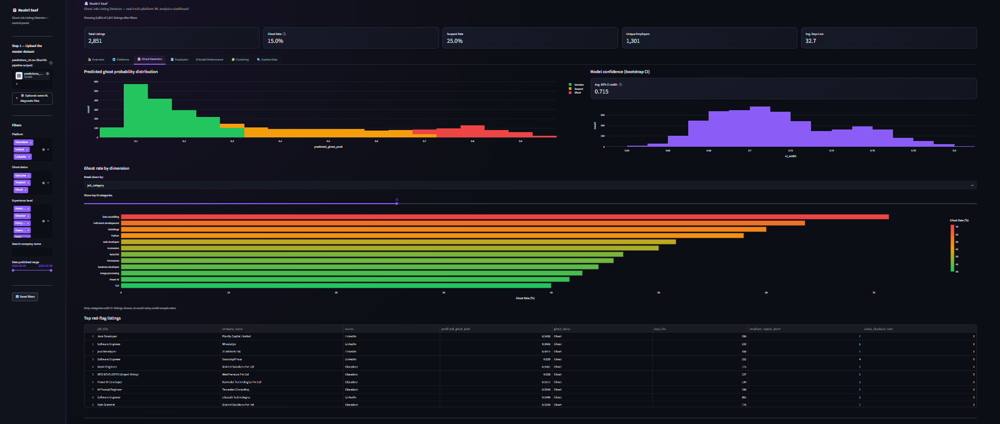</p>
<p align="center"><i>Ghost status breakdown, listings-by-platform, postings-over-time trend, and top job categories</i></p>

<br/>

**🌐 Platforms**

<p align="center">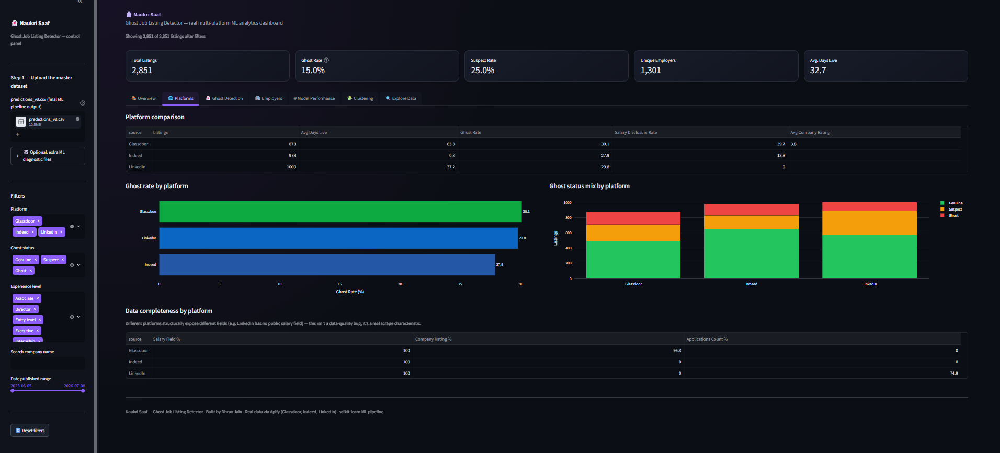</p>
<p align="center"><i>Platform comparison — ghost rate, salary disclosure rate, and data-completeness differences are genuine scrape characteristics (e.g. LinkedIn exposes no public salary field), not data-quality bugs</i></p>

<br/>

**👻 Ghost Detection**

<p align="center">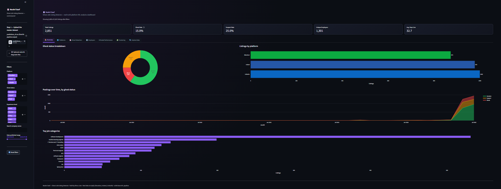</p>
<p align="center"><i>Predicted ghost-probability distribution, bootstrap CI width, ghost rate by job category, and top red-flag listings</i></p>

<br/>

**🏢 Employers**

<p align="center">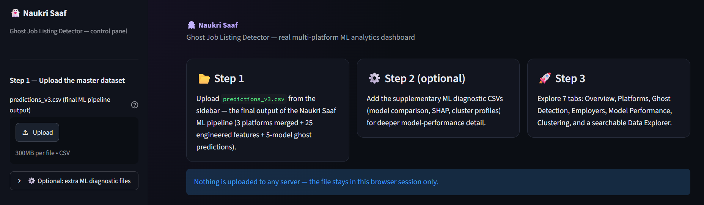</p>
<p align="center"><i>Employer risk explorer — highest-risk vs. most-trusted employers, repost count vs. ghost probability scatter</i></p>

<br/>

**🤖 Model Performance**

<p align="center">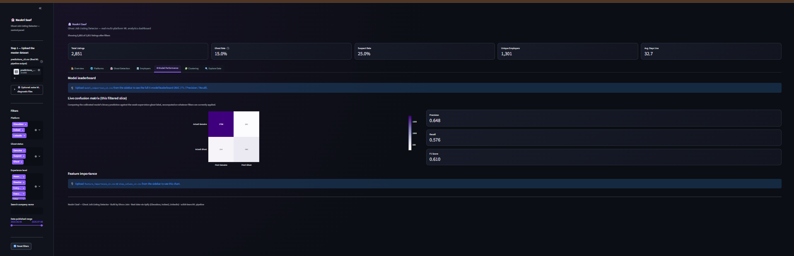</p>
<p align="center"><i>5-model leaderboard, live confusion matrix, 5-fold temporal cross-validation, and SHAP-style feature importance (25 features)</i></p>

<br/>

**🧩 Clustering**

<p align="center">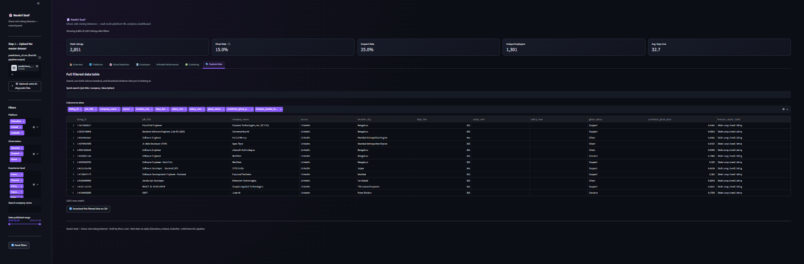</p>
<p align="center"><i>K-Means employer archetypes + DBSCAN ghost-contagion ring detection</i></p>

<br/>

**🔍 Explore Data**

<p align="center">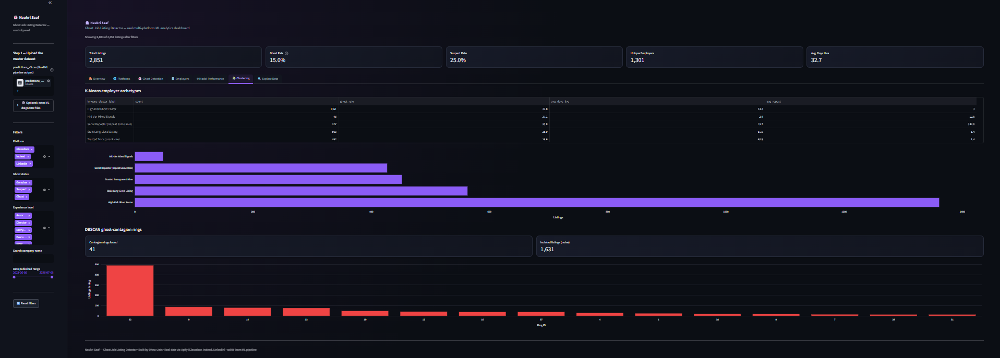</p>
<p align="center"><i>Full searchable, sortable, filterable data table with CSV export of any filtered slice</i></p>

<br/>

**🚀 Getting started (in-app onboarding)**

<p align="center">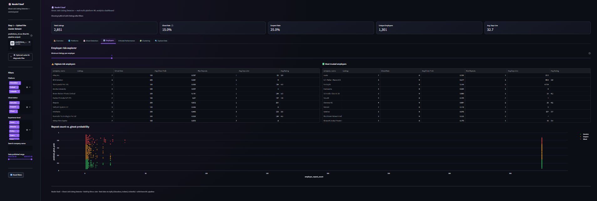</p>
<p align="center"><i>Step-by-step upload flow — the core dashboard runs off a single file; optional diagnostic CSVs unlock extra Model Performance detail</i></p>

<br/>

## 🏗️ Architecture

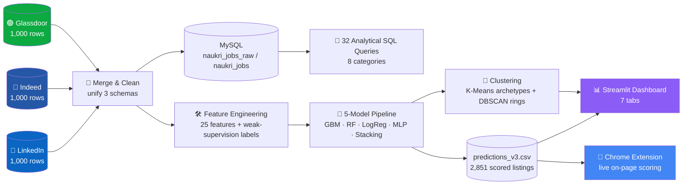

<br/>

## 📊 What's inside — 7 dashboard tabs

<details open>
<summary><b>Click to expand the full tab-by-tab breakdown</b></summary>
<br/>

| Tab | What it does |
|---|---|
| 🏠 **Overview** | Ghost status breakdown (donut), listings by platform, postings-over-time by ghost status, top job categories |
| 🌐 **Platforms** | Platform comparison table (ghost rate, salary disclosure, avg. rating), ghost status mix, and a data-completeness table that calls out real structural differences between scrapers |
| 👻 **Ghost Detection** | Predicted ghost-probability histogram, bootstrap-CI confidence chart, ghost rate broken down by any dimension (job category, city, experience level), top red-flag listings table |
| 🏢 **Employers** | Employer risk explorer — highest-risk vs. most-trusted employer tables, repost-count-vs-probability scatter, adjustable minimum-listings-per-employer filter |
| 🤖 **Model Performance** | 5-model leaderboard (AUC/F1/Precision/Recall), live confusion matrix computed on the current filtered slice, 5-fold temporal cross-validation chart, full 25-feature importance ranking |
| 🧩 **Clustering** | K-Means employer archetype table + bar chart, DBSCAN contagion-ring histogram with isolated-listing count |
| 🔍 **Explore Data** | Full searchable/sortable data table, quick text search, configurable columns, filtered-slice CSV download |

Every tab respects the sidebar filters — platform, ghost status, experience level, company search, and date-published range — and updates live.

*Drop in only `predictions_v3.csv` to unlock the whole dashboard; optionally add `model_comparison_v3.csv`, `shap_values_v3.csv`/`feature_importance_v3.csv`, `cluster_profiles_v3.csv`, and `temporal_cv_results_v3.csv` from the sidebar for the extra Model Performance detail shown above.*

</details>

<br/>

## 🤖 Machine Learning pipeline

<details>
<summary><b>Click to expand the full v3.1 pipeline — 4 parts, single notebook</b></summary>
<br/>

**PART 1 — Merge & Clean.** Glassdoor, Indeed, and LinkedIn scrapers each return a
different schema (different salary nesting, different company/location fields,
different metadata availability). This stage standardizes all three into one
2,851-row unified table.

**PART 2 — Feature Engineering + Weak-Supervision Labeling.** 25 features engineered
across five families — posting behaviour (`days_live`, `employer_repost_count`,
`posting_velocity_per_week`), text quality (`description_length_words`,
`description_lexical_diversity`, `keyword_stuffing_ratio`), compensation
(`salary_disclosed_num`, `salary_vs_market_gap`, `salary_range_ratio`), company
signals (`company_data_completeness_score`, `glassdoor_salary_combo`), and
composite/interaction terms (`velocity_x_no_salary`, `desc_per_day`). Since **no
ground-truth ghost labels exist** for real scraped data, labels were engineered from
a data-driven risk-score threshold (35.1) with soft-boundary sampling — the resulting
weak-supervision ghost rate is 29.3%.

**PART 3 — Model Training, Explainability & Validation.**

<div align="center">

| Model | AUC | F1 | Precision | Recall |
|:---|:---:|:---:|:---:|:---:|
| 🥇 **Gradient Boosting (GBM)** | **0.718** | **0.537** | 0.513 | 0.564 |
| 🥈 Stacking Ensemble (RF + GBM + LR) | 0.709 | 0.500 | 0.503 | 0.497 |
| 🥉 Random Forest (tuned, RandomizedSearchCV) | 0.708 | 0.491 | 0.503 | 0.480 |
| Logistic Regression | 0.707 | 0.480 | 0.520 | 0.447 |
| Neural Network (MLP) | 0.671 | 0.437 | 0.471 | 0.408 |

</div>

- Class imbalance handled with **SMOTE-style oversampling** (2,280 train / 571 temporal
  test split → 3,250 balanced training samples)
- **5-fold temporal cross-validation** (not random — folds respect posting date order,
  the harder and more honest test): GBM AUC climbs from 0.585 in fold 1 to 0.723 in
  fold 5 as more history becomes available
- **SHAP-style global feature importance** — top drivers are `listing_age_bucket`
  (9.9%), `days_live` (9.9%), and the engineered interaction `velocity_x_no_salary`
  (7.4%)
- **Bootstrap confidence intervals** (200 iterations) — avg. 95% CI width 0.725,
  reported per-listing in the dashboard
- **Isolation Forest** flags 285 listings (10%) as statistical anomalies independent
  of the supervised label
- Final ghost-status thresholds are **data-driven, not arbitrary**: Suspect ≥ 0.310,
  Ghost ≥ 0.703 predicted probability

**PART 4 — Final Predictions & Business Summary.** All 2,851 listings scored and
saved to `predictions_v3.csv` (86 columns — every raw field plus every engineered
feature plus every model's prediction). Final breakdown: **1,708 Genuine · 715
Suspect · 428 Ghost.**

</details>

<br/>

## 🧮 SQL analytical workbook

<details>
<summary><b>Click to expand — 32 queries across 8 categories, MySQL 8.0 / MariaDB compatible</b></summary>
<br/>

A full standalone SQL portfolio piece (`naukri_saaf_sql_workbench.sql`) built on the
~3,000-row raw combined scrape — staging table, a cleaned/typed analysis table, then:

| Category | Focus |
|---|---|
| **A — Data Profiling & Quality Checks** | Nulls, duplicates, schema sanity |
| **B — Source & Category Overview** | Per-platform, per-category aggregates |
| **C — Company Analysis** | Repost behaviour, employer-level rollups |
| **D — Location Analysis** | City/state distribution and salary patterns |
| **E — Salary Analysis** | Disclosure rates, band analysis by role/city |
| **F — Time-Based / Freshness Analysis** | Listing age, days-live distributions |
| **G — Window Functions & Ranking** | Per-company/category rankings via `RANK()`/`ROW_NUMBER()` |
| **H — Advanced Analytics** | CTEs, correlated subqueries, cross-source joins |

</details>

<br/>

## 🧩 Bonus: Chrome extension

<div align="center">
<table>
<tr>
<td width="33%">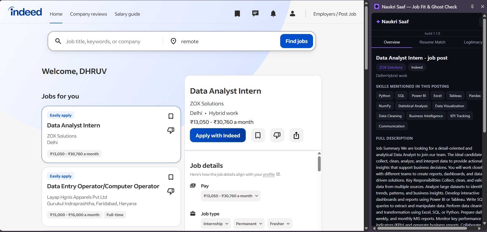</td>
<td width="33%">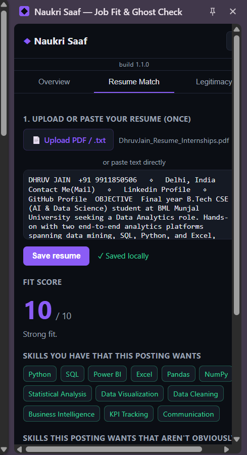</td>
<td width="33%">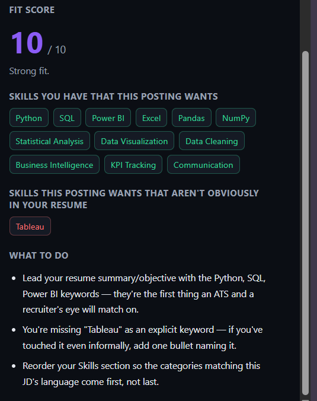</td>
</tr>
<tr>
<td align="center"><i>Overview — skills detected + quick verification links</i></td>
<td align="center"><i>Resume Match — upload once, get a live Fit Score per posting</i></td>
<td align="center"><i>Resume Match — actionable "what to do" recommendations</i></td>
</tr>
</table>
</div>

**"Naukri Saaf — Job Fit & Ghost Check"** (build 1.1.0, Manifest V3) takes the
dashboard's real, trained-model feature weights and re-implements them as a
**100% local, rule-based scorer that runs live on any job posting** — LinkedIn,
Naukri, Indeed, or Glassdoor — no backend, no API calls, no network requests of
any kind. A side panel with three tabs:

- **Overview** — site-specific DOM scraping (`content.js` has dedicated selector
  sets per portal, plus a generic largest-text-block fallback for unknown layouts)
  pulls title, company, meta, and full description; a 30-entry local
  `SKILL_DICTIONARY` (`nlp.js`) extracts skills mentioned in the posting; one-click
  verification links open pre-built Google/LinkedIn searches (Glassdoor reviews,
  AmbitionBox, company LinkedIn page, duplicate-listing check, funding news,
  scam/non-payment complaints)
- **Resume Match** — resume uploaded once as PDF (parsed client-side via `pdf.js`,
  bundled locally) or `.txt`, or pasted directly, and saved with `chrome.storage.local`
  — text never leaves the browser. Fit score (0–10) blends two local signals: skill-
  dictionary overlap (60% weight) and TF-based cosine similarity between resume and
  JD text (40% weight, via `nlp.js`'s `cosineSimilarity`). Output includes matched
  skills, missing skills, and a tailored "what to do" list that changes by score band
  (≥8 "strong fit" / 5–7 "worth tailoring" / <5 "weak fit")
- **Legitimacy** — `legitimacy.js` re-uses the **exact 25 feature-importance weights**
  from `feature_importance_v3.csv` (e.g. `days_live` 9.8%, `listing_age_bucket` 9.7%,
  `velocity_x_no_salary` 7.7%) and evaluates each one it *can* compute from the static
  page — description length/lexical diversity, salary disclosure, salary-range-ratio
  sanity check, contact-bypass patterns (WhatsApp/personal email/phone-in-description
  regexes), urgency-language phrases, remote-work ambiguity, city tier, experience
  range, company-data completeness, and a parsed "posted X ago" listing age. Risk score
  = (weighted-bad-signals ÷ weighted-computable-signals) × 100, with a coverage
  percentage showing how much of the model's total weight could even be evaluated from
  one page. ~10 heavily-weighted signals genuinely need live data the page alone can't
  provide (`employer_repost_count`, `posting_velocity_per_week`,
  `cross_platform_duplicate_flag`, `portal_ghost_baseline`, etc.) — these are shown
  separately as **"needs a manual check"** with direct search links, never silently
  guessed at. Below 35% signal coverage, the verdict itself downgrades to
  "insufficient data" rather than forcing a false-confidence answer.

**Built honestly, on purpose:** this is *not* the trained `.pkl` GBM model running in
the browser (that would need ONNX/TF.js conversion) — it's a transparent heuristic
scorecard weighted by that model's real, published feature importances. The
extension's own README says this explicitly rather than overselling it: *"Treat the
risk score as a fast triage flag, not a 0.72-AUC-grade decision."*

<br/>

## 🛠️ Tech stack

<div align="center">

| Layer | Tools |
|---|---|
| **Scraping** | Apify (Glassdoor / Indeed / LinkedIn job scrapers) |
| **App / dashboarding** | Streamlit · Plotly |
| **Machine Learning** | scikit-learn (GBM, Random Forest, Logistic Regression, MLP, Stacking) · SMOTE-style oversampling · Isolation Forest · K-Means · DBSCAN |
| **Data** | Pandas · NumPy |
| **SQL** | MySQL 8.0 / MariaDB — staging + cleaned analytical layer, 32 queries |
| **Browser extension** | Manifest V3 · vanilla JS · pdf.js (resume PDF parsing) |
| **Design system** | Dark ghost-detective theme — deep navy/near-black base, violet (`#8B5CF6`) accent, red/amber/green ghost-status palette |

</div>

<br/>

## 🚀 Quickstart

```bash
pip install -r requirements.txt
streamlit run app.py
```

Then open **`http://localhost:8501`**, upload `predictions_v3.csv` from the sidebar
(the final ML pipeline output — 2,851 real scraped listings, already scored), and the
full 7-tab dashboard unlocks. Optionally add the supplementary diagnostic CSVs for
extra Model Performance detail.

**Chrome extension** (not on the Web Store — load it unpacked):

1. Open `chrome://extensions`, turn on **Developer mode** (top-right)
2. Click **Load unpacked** → select the `naukri-saaf-extension/` folder
3. Pin it, then open any job posting on LinkedIn/Naukri/Indeed/Glassdoor and click the icon

<br/>

## 📁 Repo structure

```
naukri-saaf/
├── app.py                              # Main Streamlit dashboard — all 7 tabs
├── Naukri_Saaf_ML_Pipeline_v3_1_FINAL.ipynb  # Full 4-part ML pipeline notebook
├── naukri_saaf_sql_workbench.sql       # 32-query MySQL analytical workbook
├── naukri-saaf-extension/              # Chrome extension (Manifest V3)
│   ├── manifest.json                   # MV3 config — permissions, host access, side panel
│   ├── background.js                   # Service worker — opens the side panel
│   ├── bootstrap.js                    # Loads first — catches & displays any load-time error
│   ├── content.js                      # Per-site DOM scraping (LinkedIn/Naukri/Indeed/Glassdoor)
│   ├── sidepanel.html / .css / .js     # 3-tab side panel UI + logic
│   ├── lib/nlp.js                      # Skill dictionary + cosine similarity (resume matching)
│   ├── lib/legitimacy.js               # Risk scorer — mirrors feature_importance_v3.csv weights
│   ├── lib/pdfjs/                      # Bundled pdf.js (client-side resume PDF parsing)
│   ├── icons/                          # 16 / 48 / 128px extension icons
│   └── README.md                       # Extension-specific install guide + honest limitations
│
├── data/
│   ├── dataset_glassdoor-jobs-scraper-*.csv   # Raw Apify scrape — 1,000 rows
│   ├── dataset_indeed-job-scraper-*.csv       # Raw Apify scrape — 1,000 rows
│   ├── dataset_linkedin-job-scraper-*.csv     # Raw Apify scrape — 1,000 rows
│   ├── naukri_saaf_combined_raw.csv           # 3 platforms merged — 3,000 rows
│   ├── unified_job_listings.csv               # Cleaned/standardized — 2,851 rows
│   ├── naukri_saaf_v3_dataset.csv             # + 25 engineered features — 73 cols
│   └── predictions_v3.csv                     # Final scored output — 86 cols
│
├── models/
│   ├── gbm_model_v3.pkl                # Best model — AUC 0.718
│   ├── rf_model_v3.pkl
│   ├── mlp_model_v3.pkl
│   ├── stacking_model_v3.pkl
│   └── scaler_v3.pkl
│
├── diagnostics/
│   ├── model_comparison_v3.csv         # 5-model leaderboard
│   ├── feature_importance_v3.csv       # 25-feature SHAP-style ranking
│   ├── shap_values_v3.csv
│   ├── bootstrap_ci_v3.csv             # Per-listing 95% CI (200 iterations)
│   ├── cluster_profiles_v3.csv         # K-Means 5-archetype summary
│   └── temporal_cv_results_v3.csv      # 5-fold time-based CV results
│
├── Naukri_Saaf_Master_Workbook.xlsx    # Excel companion workbook
├── requirements.txt
├── .streamlit/config.toml              # Dark ghost-detective theme
└── README.md
```

<br/>

## ⚠️ Honest limitations

This project is built on **real scraped data, not synthetic data** — and it's shown
transparently rather than dressed up:

- **No ground-truth ghost labels exist.** Labels are weak-supervision, derived from a
  data-driven risk-score threshold, not verified real-world outcomes. AUC ≈ 0.72
  reflects this — a genuinely hard, honestly-reported ceiling, not a cherry-picked
  number.
- **Stacking Ensemble underperforms its base learners on this dataset** — a real,
  investigated finding (meta-learner overfits on a modest 2,851-row training set with
  228 base ghost labels), not hidden.
- **Platforms structurally differ** — LinkedIn exposes no public salary field, Indeed
  shows almost no company-rating data. The dashboard calls this out explicitly rather
  than treating it as a data-quality bug.
- **DBSCAN's 1,631 "isolated" listings** are mostly genuine, low-repost postings —
  the algorithm is tuned to surface *dense contagion rings*, not to flag the average
  listing as suspicious.

<br/>

## 🗺️ Roadmap

- [ ] Live pipeline execution from inside the dashboard (currently upload-based)
- [ ] Chrome Web Store listing for the extension
- [x] Real multi-platform data (migrated off the original synthetic dataset)
- [x] 5-model ensemble with temporal cross-validation

<br/>

## 📫 Connect

<div align="center">

Open to Data Analyst / Business Analyst roles and collaborations — feel free to reach out.

<a href="https://github.com/jaindhruv1923/Project-Naukri-Saaf-Job-Listings-Analysis">
  
</a>
<a href="https://www.linkedin.com/in/jaindhruv1923">
  
</a>
<a href="mailto:jaindhruv1923@gmail.com">
  
</a>

</div>

<br/>

<div align="center">

**[Dhruv Jain](https://github.com/jaindhruv1923/Project-Naukri-Saaf-Job-Listings-Analysis)** · [LinkedIn](https://www.linkedin.com/in/jaindhruv1923) · [jaindhruv1923@gmail.com](mailto:jaindhruv1923@gmail.com)


</div>
