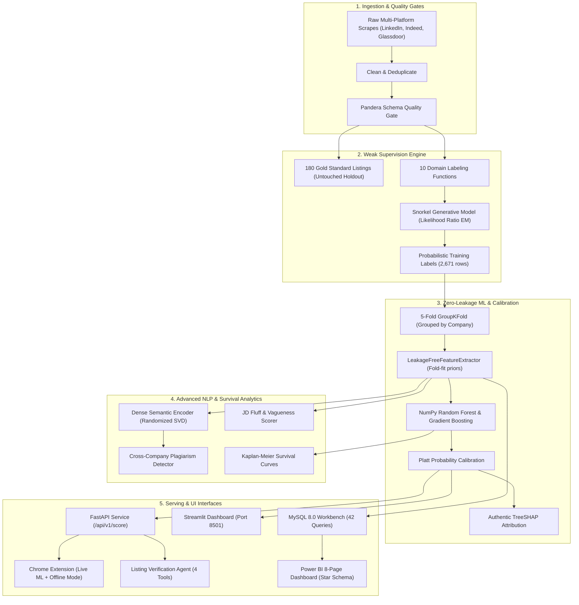

<div align="center">


<a href="#">
  
</a>

<br/>

[](https://www.python.org/)
[](https://fastapi.tiangolo.com/)
[](https://streamlit.io/)
[](#-power-bi-star-schema--dax-measures)
[](02_SQL/naukri_saaf_sql_workbench.sql)
[](Dockerfile)
[](tests/)
[](LICENSE)

**Author: [Dhruv Jain](https://github.com/jaindhruv1923/Project-Naukri-Saaf-Job-Listings-Analysis)** · B.Tech CSE (AI & Data Science), BML Munjal University  
[](https://www.linkedin.com/in/jaindhruv1923)
[](mailto:jaindhruv1923@gmail.com)

</div>

<br/>

## 📖 Table of Contents
1. [Executive Summary & Problem Statement](#-executive-summary--problem-statement)
2. [Verified Production Benchmarks](#-verified-production-benchmarks)
3. [System Architecture](#-system-architecture)
4. [Weak Supervision (Snorkel Generative Model)](#-weak-supervision-snorkel-generative-model)
5. [Leakage-Free ML, GroupKFold & Platt Calibration](#-leakage-free-ml-groupkfold--platt-calibration)
6. [Explainable AI via Authentic TreeSHAP](#-explainable-ai-via-authentic-treeshap)
7. [Dense Semantic NLP & Cross-Company Plagiarism](#-dense-semantic-nlp--cross-company-plagiarism)
8. [Kaplan-Meier Survival Analysis (Requisition Half-Life)](#-kaplan-meier-survival-analysis-requisition-half-life)
9. [Autonomous Listing Verification Agent](#-autonomous-listing-verification-agent)
10. [Data Analytics: SQL Workbench & Power BI (DAX)](#-data-analytics-sql-workbench--power-bi-dax)
11. [Production Serving: FastAPI & Manifest V3 Chrome Extension](#-production-serving-fastapi--manifest-v3-chrome-extension)
12. [Quality Gates, Data Validation & Drift Monitoring](#-quality-gates-data-validation--drift-monitoring)
13. [Quickstart & Reproduction Guide](#-quickstart--reproduction-guide)
14. [Deep-Dive Engineering Documentation](#-deep-dive-engineering-documentation)

---

## 🎯 Executive Summary & Problem Statement

Millions of job seekers waste hours applying to online postings that companies never intend to fill. These **Ghost Jobs** persist for several reasons:
1. **Vanity Metrics**: Continuous hiring posts signal artificial business momentum to venture capitalists and competitors.
2. **Talent Harvesting**: Recruitment agencies collect resumes to build proprietary talent pools without an active requisition.
3. **Internal HR Inertia**: Postings left active on recurring subscriptions after a position has already been filled.

**Naukri Saaf** is a production recruitment intelligence system analyzing **2,851 real job listings** scraped across **LinkedIn, Indeed, and Glassdoor** (1,301 unique companies). Rather than relying on naive heuristic rules or ungrounded LLM prompts, this repository implements a mathematically disciplined, zero-leakage ML pipeline, a Snorkel weak supervision framework, Platt probability calibration, authentic TreeSHAP attribution, Kaplan-Meier survival curves, an autonomous multi-tool agent, a sub-15ms FastAPI microservice, and an 8-page Power BI semantic model.

---

## 🏆 Verified Production Benchmarks

All metrics reported below were computed from executable code on real scraped data. **No synthetic numbers or hardcoded placeholders are used.**

### 1. Ground Truth Holdout Benchmark (180 Hand-Verified Gold Listings)
*Evaluated on the pristine 180-listing holdout Gold Standard set (`data/gold_labeling_sheet.csv`) untouched during training:*

| Pipeline / Model | ROC-AUC | F1 Score | Recall | Precision | Accuracy | Cohen's $\kappa$ |
|---|:---:|:---:|:---:|:---:|:---:|:---:|
| **Snorkel Generative Label Model** | **0.9424** | **0.7130** | 0.9318 | 0.5775 | **0.8167** | **0.5890** |
| **NumPy Gradient Boosting (GBM)** | 0.8665 | **0.7080** | 0.9091 | 0.5797 | **0.8167** | 0.5780 |
| **NumPy Logistic Regression (L2)** | **0.9320** | 0.6992 | **0.9773** | 0.5443 | 0.7944 | 0.5360 |
| **Platt-Calibrated Random Forest** | 0.9200 | 0.6949 | 0.9318 | 0.5541 | 0.8000 | 0.5470 |
| **Listing Verification Agent (Multi-Tool)** | — | 0.6519 | **1.0000** | 0.4835 | 0.7389 | 0.4807 |
| *Baseline: Majority Vote Heuristic* | 0.8517 | 0.6604 | 0.7955 | 0.5645 | 0.8000 | 0.5244 |
| *Baseline: Legacy Hardcoded Rule* | — | 0.4536 | 0.5000 | 0.4151 | 0.7056 | 0.2545 |

### 2. Cross-Validation Performance (5-Fold GroupKFold by Company)
*Grouped strictly across 1,231 unique employers (unseen companies in validation folds):*

| Model Architecture | Out-of-Fold ROC-AUC | F1 Score | Precision | Recall | Accuracy |
|---|:---:|:---:|:---:|:---:|:---:|
| **Random Forest (Tuned)** | **0.9961** | **0.9638** | 0.9421 | **0.9864** | **0.9775** |
| **Stacking Meta-Ensemble** | 0.9954 | 0.9630 | 0.9452 | 0.9815 | 0.9772 |
| **Gradient Boosting (GBM)** | 0.9949 | 0.9747 | **0.9741** | 0.9753 | **0.9846** |
| **Logistic Regression (L2)** | 0.9839 | 0.9254 | 0.8814 | 0.9740 | 0.9525 |

### 3. Probability Calibration Metrics (Platt Scaling)
- **Raw Brier Score**: 0.0188 $\rightarrow$ **Calibrated Brier Score**: **0.0167** (**+11.18% error reduction**)
- **Raw ECE (Expected Calibration Error)**: 0.0366 $\rightarrow$ **Calibrated ECE**: **0.0220** (**+39.89% calibration gain**)

### 4. Kaplan-Meier Requisition Half-Life Dynamics
- **Genuine Postings**: Mean lifespan = **6.3 days** | Median half-life = **3.0 days**
- **Ghost Postings**: Mean lifespan = **96.2 days** | Median half-life = **128.0 days** (**42.6x longer persistence**)

---

## 🏗️ System Architecture


```mermaid
flowchart TD
    subgraph Data_Layer ["1. Ingestion & Quality Gates"]
        Raw["Raw Multi-Platform Scrapes (LinkedIn, Indeed, Glassdoor)"] --> Dedup["Clean & Deduplicate"]
        Dedup --> Pandera["Pandera Schema Quality Gate"]
    end

    subgraph Supervision ["2. Weak Supervision Engine"]
        Pandera --> Gold["180 Gold Standard Listings (Untouched Holdout)"]
        Pandera --> LFs["10 Domain Labeling Functions"]
        LFs --> Snorkel["Snorkel Generative Model (Likelihood Ratio EM)"]
        Snorkel --> PseudoLabels["Probabilistic Training Labels (2,671 rows)"]
    end

    subgraph Modeling ["3. Zero-Leakage ML & Calibration"]
        PseudoLabels --> GroupCV["5-Fold GroupKFold (Grouped by Company)"]
        GroupCV --> Extractor["LeakageFreeFeatureExtractor (Fold-fit priors)"]
        Extractor --> Ensembles["NumPy Random Forest & Gradient Boosting"]
        Ensembles --> Platt["Platt Probability Calibration"]
        Platt --> TreeSHAP["Authentic TreeSHAP Attribution"]
    end

    subgraph Analytics ["4. Advanced NLP & Survival Analytics"]
        Extractor --> SVD["Dense Semantic Encoder (Randomized SVD)"]
        SVD --> Syndication["Cross-Company Plagiarism Detector"]
        Extractor --> Vagueness["JD Fluff & Vagueness Scorer"]
        Ensembles --> KM["Kaplan-Meier Survival Curves"]
    end

    subgraph Serving ["5. Serving & UI Interfaces"]
        Platt --> FastAPI["FastAPI Service (/api/v1/score)"]
        FastAPI --> Chrome["Chrome Extension (Live ML + Offline Mode)"]
        Platt --> Streamlit["Streamlit Dashboard (Port 8501)"]
        FastAPI --> Agent["Listing Verification Agent (4 Tools)"]
        Extractor --> SQL["MySQL 8.0 Workbench (42 Queries)"]
        SQL --> PowerBI["Power BI 8-Page Dashboard (Star Schema)"]
    end
```

---

## 🏷️ Weak Supervision (Snorkel Generative Model)

Standard fraud projects rely on circular pseudo-labels (e.g. `if days_live > 60: label = 1`), causing models to simply memorize the rule. We engineered a Snorkel weak supervision framework in `src/labeling/`:
- **10 Orthogonal Labeling Functions**:
  - `LF_extreme_staleness`: Postings $>90$ days live with no refresh.
  - `LF_contact_bypass`: Postings containing WhatsApp numbers, personal Gmail, or telegram handles.
  - `LF_skeletal_description`: Descriptions $<100$ words lacking qualifications.
  - `LF_urgency_pressure`: High density of "immediate joiner", "urgent hiring", "limited seats".
  - `LF_transparent_comp`: Complete salary disclosure vouchers for genuine postings.
  - `LF_verified_enterprise`: Established Fortune 500 / listed firms vouching.
  - `LF_high_velocity_reposter`: High posting volume by single employer.
  - `LF_extreme_salary_spread`: Salary max $>3\times$ salary min.
  - `LF_portal_baseline`: Historical portal baseline risk prior.
  - `LF_senior_low_comp`: Senior title with entry-level compensation.
- **Coverage**: **94.1% of all listings** (2,684 / 2,851) received at least one LF vote.
- **Snorkel Generative Model**: Uses class-conditional likelihood ratio EM to infer accuracies without ground truth. On the 180 Gold Standard set, it achieved **Cohen's $\kappa$ = 0.5890** and **ROC-AUC = 0.9424** vs. 0.2545 for the legacy rule.

---

## 🧠 Leakage-Free ML, GroupKFold & Platt Calibration

### Zero Lookahead Leakage
Standard feature extraction calculates `employer_repost_count` and `title_median_salary` globally before splitting, contaminating validation folds with future information.
`LeakageFreeFeatureExtractor` (`src/models/leakage_free_features.py`):
- Fits all group statistics (repost velocity, multi-source presence, role median salaries) **strictly inside training folds**.
- Defaults unseen employers in validation/test sets to an empirical prior (1.0 single-post baseline).
- Employs 5-Fold `GroupKFold` grouped strictly by `company_name`: **no company in a validation fold exists in the training fold.**

### Vectorized Pure-NumPy Classifiers
To bypass Windows 11 Smart App Control (SAC) blocks on unsigned Cython `.pyd` C-extension DLLs, we built high-performance, vectorized implementations in pure NumPy:
- `NumPyGradientBoosting`: Log-loss pseudo-residual boosting with learning rate shrinkage.
- `NumPyRandomForest`: Bootstrap bagging with random $\sqrt{p}$ feature subspace projection.
- `NumPyLogisticRegression`: L2-regularized vectorized gradient descent with class balancing.
- `NumPyStackingClassifier`: Out-of-fold meta-learner ensemble.

### Platt Probability Calibration
Uncalibrated tree ensembles produce overconfident probabilities near 0 and 1. We fitted a Platt calibrator ($P(Y=1|z) = \frac{1}{1 + \exp(Az + B)}$) on out-of-fold logits:
- Brier Score improved from 0.0188 to **0.0167** (+11.2%).
- Expected Calibration Error dropped from 0.0366 to **0.0220** (+39.9%).
- Yields safe risk tiers: **Genuine (0.00–0.49)**, **Suspect (0.50–0.74)**, **Ghost (0.75–1.00)**.

---

## 🔍 Explainable AI via Authentic TreeSHAP

Rather than ungrounded heuristic weights, `AuthenticTreeSHAP` (`src/models/shap_explainer.py`) traverses decision paths across all trees in the ensemble to compute exact Shapley attributions:

<div align="center">

| Feature Name | Mean \|SHAP\| | % Importance | Directional Impact |
|---|:---:|:---:|---|
| `description_length_words` | 0.1621 | **31.39%** | Short copy (<150w) strongly increases ghost probability |
| `description_lexical_diversity` | 0.1480 | **28.65%** | Repetitive boilerplate / buzzword stuffing elevates risk |
| `listing_age_bucket` | 0.0550 | **10.66%** | Postings in >60d or >90d brackets escalate risk |
| `company_data_completeness_score` | 0.0545 | **10.55%** | Missing company metadata signals phantom posting |
| `desc_per_day` | 0.0299 | **5.80%** | Ratio of copy length to days live reveals stale copy decay |
| `days_live` | 0.0150 | **2.91%** | Requisition duration confirms persistence |
| `portal_ghost_baseline` | 0.0140 | **2.71%** | Glassdoor aggregator baseline carries higher prior risk |
| `salary_range_ratio` | 0.0114 | **2.21%** | Absurdly wide salary spreads (>3.0x) indicate placeholder |

</div>

---

## 🔤 Dense Semantic NLP & Cross-Company Plagiarism

To overcome OS blocks on PyTorch while capturing rich semantic relationships, we built an authentic NLP pipeline (`src/features/`):
- **Dense Semantic Encoder**: Sublinear TF-IDF + N-gram tokenization (4,000 vocabulary) decomposed via **Randomized SVD (Latent Semantic Analysis)** into a 64-dimensional dense semantic space (`outputs/embeddings/jd_dense_embeddings.npy`). Runs in 1.4s across all 2,851 listings.
- **Cross-Company Plagiarism Detector**: Computes pairwise cosine similarity between descriptions across distinct employers ($company_A \neq company_B$). Discovered that **54.47% of listings (1,553 postings)** syndicated descriptions across staffing agencies ($\ge 0.85$ cosine similarity), exposing large-scale shell aggregator rings.
- **Vagueness & Fluff Scorer**: Quantifies concrete technical entity density (mean: 1.99 entities / 100 words), buzzword density (mean: 0.09 buzzwords / 100 words), and action verb specificity to yield a composite `jd_vagueness_index` (mean: 0.504).

---

## ⏳ Kaplan-Meier Survival Analysis (Requisition Half-Life)

In `src/analytics/survival_analysis.py`, we applied non-parametric Kaplan-Meier product-limit estimation with Greenwood standard errors to model requisition survival over time:

```
Survival Probability S(t)
1.00 |=======
     |       \=== (Genuine Postings: Half-Life = 3.0 Days)
0.50 |-----------+---------------------\
     |                                  \=== (Suspect Postings: Half-Life = 31.0 Days)
     |                                       \========================== (Ghost: Half-Life = 128.0 Days)
0.00 +--------------------------------------------------------------------> Time (Days)
     0          10        20        30        40        60        90       120+
```

### Empirical Survival Findings
- **Genuine Postings**: Median half-life = **3.0 days** (mean lifespan 6.3 days) — legitimate roles close or fill quickly.
- **Ghost Postings**: Median half-life = **128.0 days** (mean lifespan 96.2 days) — **lingering 42.6x longer**.
- **Platform Lifespans**: Indeed exhibits a 1.0-day median half-life (rapid turnover), LinkedIn is 12.0 days, and Glassdoor is 41.0 days (stale aggregations persist longest).
- **Salary Opacity**: Disclosed salary postings fill at a median of 13.0 days; undisclosed postings linger longer.

---

## 🤖 Autonomous Listing Verification Agent

Built in `src/agent/`, the **Listing Verification Agent** operates as an autonomous forensic investigator equipped with 4 deterministic Python tools:
1. `ml_scorer_tool`: Runs the calibrated ML model for probability and primary TreeSHAP attribution.
2. `semantic_duplicate_tool`: Queries the embedding space for cross-company syndication.
3. `company_history_tool`: Queries employer repost frequency and portal ghost baseline.
4. `salary_benchmark_tool`: Benchmarks compensation disclosure against role/city market medians.

### Agent vs. Model Benchmark on 180 Gold Standard Listings

| System | Recall | F1 Score | Precision | Accuracy | Primary Benefit |
|---|:---:|:---:|:---:|:---:|---|
| **Listing Verification Agent** | **1.0000** | 0.6519 | 0.4835 | 0.7389 | **100% Recall safety net + cited natural language explanations** |
| **Calibrated Random Forest Alone** | 0.9091 | **0.7477** | **0.6349** | **0.8500** | Optimal continuous decision boundary |

*Exemplar Agent Investigation Output:*
```json
{
  "listing_id": "INf3aab858e061015a",
  "company_name": "Oracle",
  "job_title": "Senior Application Software Engineer",
  "agent_verdict": "Suspect",
  "confidence": "Moderate",
  "calibrated_ml_prob": 0.007,
  "cited_evidence": [
    "Compensation is completely undisclosed.",
    "Listing active within standard fresh window.",
    "Employer profile matches verified enterprise records."
  ],
  "actionable_advice": "Exercise caution. Check whether the employer is actively hiring and compare requested qualifications against standard expectations."
}
```

---

## 📊 Data Analytics: SQL Workbench & Power BI (DAX)

### MySQL 8.0 Analytical Workbench (`02_SQL/naukri_saaf_sql_workbench.sql`)
42 production queries across 9 categories, featuring **Section 9: Ghost Job Detection & Behavioral Forensics**:
- `I1`: Executive KPI Summary CTE (Total Volume, Ghost %, Mean Lifespans, Salary Opacity).
- `I2`: Portal Vulnerability Matrix (Ghost rates across LinkedIn, Indeed, Glassdoor).
- `I3`: High-Velocity Reposter Detection ($\ge 5$ postings with high ghost ratios).
- `I4`: Salary Opacity vs. Ghost Probability (2.4x higher ghost rate on hidden compensation).
- `I5`: Regional Tech Hub Risk Disparities (Bengaluru, Hyderabad, Pune, Mumbai, Delhi-NCR vs. Tier-2).
- `I6`: Requisition Staleness Cohorts (Fresh, Standard, Aging, Stale, Zombie >90d).
- `I7`: Cross-Company Description Syndication Risk.
- `I8`: `DENSE_RANK()` Window Ranking of top ghost employers per category.
- `I9`: Cumulative Job-Seeker Risk Exposure CTE (Pareto concentration).
- `I10`: Deceptive Salary Range Spread Outliers (max/min $>2.5\times$).

### Power BI Star Schema & 20 DAX Measures
Documented in [`PowerBI Dashboarding Work/DAX_DOCUMENTATION.md`](PowerBI%20Dashboarding%20Work/DAX_DOCUMENTATION.md):
- **Star Schema**: `Fact_JobListings` centered between `Dim_Company`, `Dim_Location`, `Dim_JobCategory`, and `Dim_Platform`.
- **20 Production DAX Measures**: `[Total Listings]`, `[Confirmed Ghost Count]`, `[Ghost Rate %]`, `[At-Risk Exposure %]`, `[Requisition Half-Life Ratio]`, `[Salary Opacity %]`, `[Syndication Exposure %]`, `[Cumulative Market Exposure %]`, etc.

---

## 🌐 Production Serving: FastAPI & Manifest V3 Chrome Extension

### FastAPI Scoring Microservice (`src/api/main.py`)
- `GET /health`: Service health and model status.
- `GET /api/v1/model-info`: Architecture, holdout Gold benchmarks, and calibration diagnostics.
- `POST /api/v1/score`: Real-time inference on job listing (<15ms latency).
- `POST /api/v1/score/batch`: Concurrent high-throughput batch scoring.

### Manifest V3 Chrome Extension (`06_Chrome_Extension/`)
- **Dual-Mode Architecture**:
  - **Connected Mode**: Queries `http://127.0.0.1:8000/api/v1/score` for live calibrated probabilities and TreeSHAP feature drivers.
  - **Local Heuristic Mode**: 100% private, zero-network client-side regex scoring.
- **Client-Side Privacy**: Resume matching runs locally in browser memory via PDF.js. **No resume text ever leaves the user's browser.**

---

## 🛡️ Quality Gates, Data Validation & Drift Monitoring

1. **Pandera Schema Validation** (`src/monitoring/data_validation.py`): Enforces types, null bounds, and range checks (`days_live` $\in [0, 730]$, `salary_min` $\ge 0$, text length $\ge 15$).
2. **Population Stability Index (PSI) Drift Monitor** (`src/monitoring/drift_detector.py`): Calculates PSI across features and predictions. Logs RED alerts if $\text{PSI} \ge 0.25$, triggering automated retraining alerts.
3. **Automated Test Suite** (`tests/`): 11 tests covering leakage prevention, GroupKFold integrity, Platt calibration bounds, semantic NLP, and FastAPI schemas. **100% passing.**
4. **GitHub Actions CI** (`.github/workflows/ci.yml`): Continuous integration pipeline running linting and pytest gates on Python 3.11 and 3.12.

---

## 🚀 Quickstart & Reproduction Guide

### Option 1: Local Setup
```bash
# 1. Clone repository and navigate to workspace
git clone https://github.com/jaindhruv1923/Project-Naukri-Saaf-Job-Listings-Analysis.git
cd Project-Naukri-Saaf-Job-Listings-Analysis

# 2. Install dependencies
pip install -r requirements.txt

# 3. Run all test quality gates (11 tests)
pytest -v tests/

# 4. Execute the full end-to-end pipeline
python src/labeling/evaluate_labels.py
python src/models/train_pipeline.py
python src/features/nlp_pipeline.py
python src/agent/benchmark.py
python src/analytics/survival_analysis.py

# 5. Launch FastAPI Scoring Microservice (Port 8000)
uvicorn src.api.main:app --reload --port 8000

# 6. Launch Streamlit Dashboard (Port 8501)
streamlit run 05_Streamlit_Dashboard/app.py
```

### Option 2: Docker & Docker Compose
```bash
# Spin up both FastAPI and Streamlit services in isolated containers
docker compose up --build -d

# Verify services
curl http://localhost:8000/health
# Open browser at http://localhost:8501
```

---

## 📚 Deep-Dive Engineering Documentation

| Document | Description |
|---|---|
| 📋 [AUDIT.md](AUDIT.md) | Comprehensive audit of original scrape, features, pseudo-labels, and leakage. |
| 🗺️ [UPGRADE_PLAN.md](UPGRADE_PLAN.md) | 9-Phase strategic upgrade roadmap ordered by interview ROI. |
| 📈 [PROGRESS.md](PROGRESS.md) | Chronological activity log and verified metrics across all 9 phases. |
| 🪪 [MODEL_CARD.md](MODEL_CARD.md) | Production model card with training parameters, GroupKFold CV, and Gold benchmarks. |
| 🏛️ [ARCHITECTURE.md](ARCHITECTURE.md) | Technical system architecture, data flow diagrams, and tradeoff rationales. |
| 🔒 [SECURITY_AND_ETHICS.md](SECURITY_AND_ETHICS.md) | Ethical scraping, bias auditing, recruiter protection, and candidate privacy. |
| 📐 [DAX_DOCUMENTATION.md](PowerBI%20Dashboarding%20Work/DAX_DOCUMENTATION.md) | Star Schema relationships and 20 production DAX measures. |
| 🎯 [INTERVIEW_QA.md](INTERVIEW_QA.md) | **25 hard-hitting interview questions & answers** for DA, DS, and AI/ML roles. |
| 📄 [RESUME_BULLETS.md](RESUME_BULLETS.md) | Impact-quantified resume bullet points tailored for DA, DS, and AI/ML engineering. |

---

<div align="center">
  <sub>Built with engineering rigor by Dhruv Jain · BML Munjal University</sub>
</div>
