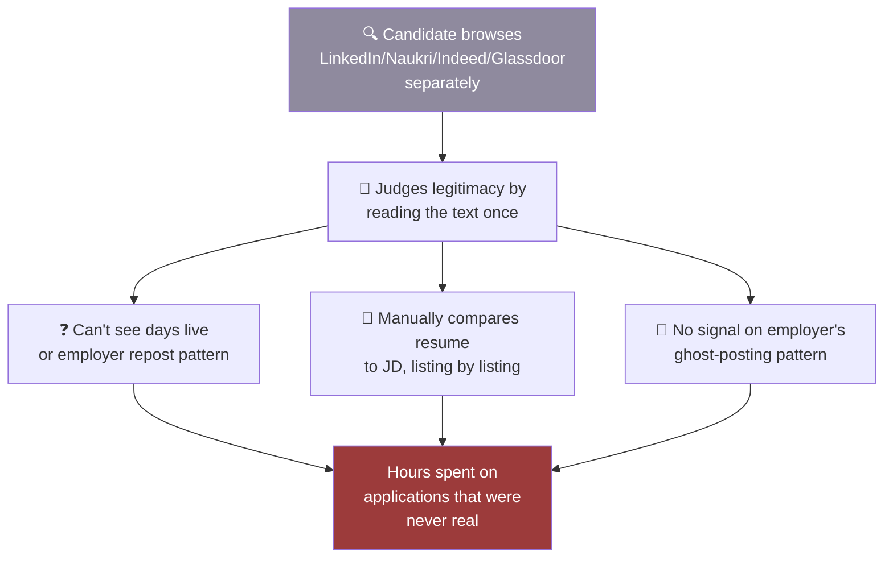
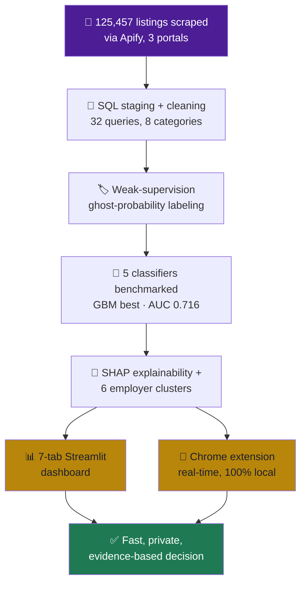

## 🔴 As-Is — before Naukri Saaf

<b>Pain points (click to expand)</b>

 

- Ghost-listing signals are scattered and platform-specific
- Individual listing text alone is a weak signal vs. employer-level patterns
- Resume-to-JD fit judged manually, listing by listing
- Zero transparency on what can/can't be verified before applying

 

---

## 🟢 To-Be — with Naukri Saaf

 

## 🔀 What changed, step by step

| Step | 🔴 As-Is | 🟢 To-Be |
|---|---|---|
| **Data coverage** | Portals checked one at a time | 125,457 listings unified in one SQL layer |
| **Legitimacy check** | Gut feel, one read-through | Model-weighted risk score from 26 signals |
| **Employer pattern visibility** | Invisible to candidate | 6 behavioral clusters surfaced |
| **Resume fit** | Manual, per listing | Automatic 0–10 score, computed locally |
| **Transparency** | None | Verified-on-page vs manual-check, weights shown |
| **Privacy** | N/A | 100% local, resume never leaves the browser |

 

## 🎓 Why this matters for a BA read

Identify where the current process breaks down for the end user (no portable trust signal), then trace each To-Be capability back to a specific BRD requirement and build artifact — not a vague "AI-powered" claim.

 

<i>NAUKRI SAAF · Dhruv Jain · <a href="./README.md">← back to index</a></i>

