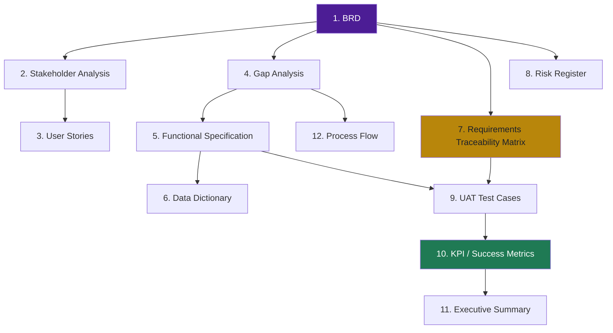

## 📁 What's in this package

Every standard BA deliverable, built against the real Naukri Saaf pipeline (125,457 scraped listings → 2,852 modeled → GBM AUC 0.716 → 7-tab dashboard → Chrome extension). Nothing here is generic filler — every artifact traces back to an actual file, model, or feature in the build.

| # | Document | BA discipline it demonstrates |
|---|---|---|
| 1 | [`BRD_NaukriSaaf.md`](./BRD_NaukriSaaf.md) | Requirements elicitation & documentation |
| 2 | [`Stakeholder_Analysis.md`](./Stakeholder_Analysis.md) | Stakeholder mapping, power/interest, RACI |
| 3 | [`User_Stories.md`](./User_Stories.md) | Agile requirements, Gherkin acceptance criteria |
| 4 | [`Gap_Analysis.md`](./Gap_Analysis.md) | Current-vs-future state, capability gaps |
| 5 | [`Functional_Specification.md`](./Functional_Specification.md) | Detailed functional spec, business rules |
| 6 | [`Data_Dictionary.md`](./Data_Dictionary.md) | Data governance, field-level definitions |
| 7 | [`Requirements_Traceability_Matrix.md`](./Requirements_Traceability_Matrix.md) | Traceability from requirement → build → test |
| 8 | [`Risk_Register.md`](./Risk_Register.md) | Risk identification, scoring, mitigation |
| 9 | [`UAT_Test_Cases.md`](./UAT_Test_Cases.md) | Acceptance testing, sign-off criteria |
| 10 | [`KPI_Success_Metrics.md`](./KPI_Success_Metrics.md) | Post-launch measurement framework |
| 11 | [`Executive_Summary_NaukriSaaf.md`](./Executive_Summary_NaukriSaaf.md) | Stakeholder communication, findings synthesis |
| 12 | [`Process_Flow_NaukriSaaf.md`](./Process_Flow_NaukriSaaf.md) | As-Is/To-Be process mapping |

 

## 🧭 How a BA would actually use these, in order

 

## 🎯 Reference facts used throughout

| Metric | Value |
|:---|:---:|
| Raw listings scraped | **125,457** (LinkedIn, Indeed, Glassdoor) |
| Unique listings modeled | **2,852** |
| Best model | **GBM — AUC 0.716, F1 0.527** |
| Ghost-risk model features | **26**, SHAP-explained per listing |
| Highest-risk employer cluster | **1,361 employers · 32.8% ghost rate** |
| Chrome extension coverage | **~62% of model weight** verifiable from a single page; ~38% flagged manual-check |
| Dashboard | **7 tabs** — Overview, Platforms, Ghost Detection, Employers, Model Performance, Cluster, Explore |

 

<i>Part of the Naukri Saaf project · Dhruv Jain</i>

