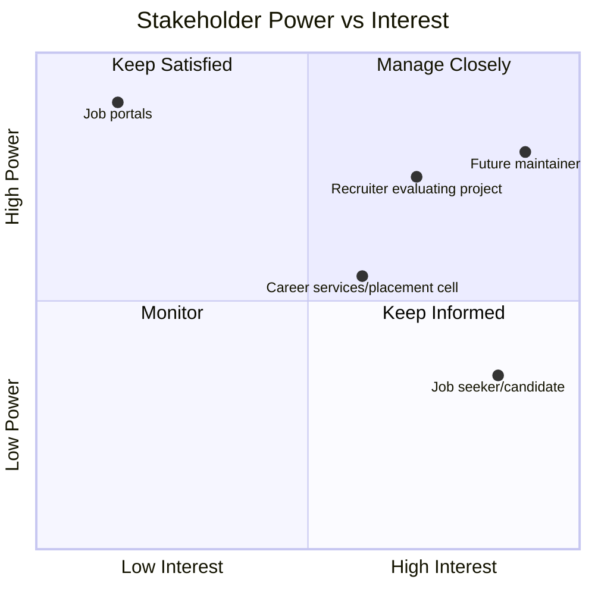

## 1. Stakeholder Register

| Stakeholder | Role type | Primary need | Success looks like |
|---|---|---|---|
| 🧑‍💻 **Job seeker / candidate** | End user | A fast, trustworthy signal before applying | Applies with confidence, wastes less time on ghost listings |
| 🎓 **University career services / placement cell** | Sponsor-adjacent | Vet postings shared with students | Fewer complaints about dead-end postings circulated to students |
| 📊 **Recruiter/interviewer evaluating this project** | External evaluator | Evidence of full analytics + BA lifecycle | Sees a defensible, end-to-end build, not just a model |
| 🛠️ **Future maintainer (project owner)** | Internal | A system that can be extended/retrained | Documented signals, clean SQL layer, versioned model artifacts |
| 🌐 **Job portals (LinkedIn, Naukri, Indeed, Glassdoor)** | Indirect / passive | Not directly served — extension reads public page content only | N/A — out of scope for active engagement |

 

## 2. Power / Interest Grid

**Reading this grid:**
- **Future maintainer & evaluating recruiter** (high power, high interest) → *Manage closely* — every artifact in this package is written for them first
- **Job portals** (high power over the product's ability to function, low direct interest) → *Keep satisfied* — the extension only reads public page content and makes no calls back to the portal, by design, to avoid any friction
- **Job seeker** (high interest, lower power over the project itself) → *Keep informed* — the honest "manual check" disclosures exist specifically for this group's trust

 

## 3. RACI Matrix

*(Responsible / Accountable / Consulted / Informed — mapped against the project's own solo-build workflow, showing how each activity's ownership would generalize to a team setting)*

| Activity | Data Engineer | Data Scientist | BA / Product | End User (Candidate) |
|---|:---:|:---:|:---:|:---:|
| Scrape & unify listings (SQL layer) | **R/A** | C | I | — |
| Weak-supervision label design | C | **R/A** | C | — |
| Model training & benchmarking | I | **R/A** | C | — |
| SHAP explainability & clustering | I | **R/A** | C | — |
| Dashboard requirements & design | C | C | **R/A** | I |
| Chrome extension requirements | C | C | **R/A** | C |
| Extension signal-weight disclosure copy | I | C | **R/A** | C |
| UAT sign-off | I | I | **R** | **A** |

 

## 4. Communication Needs by Stakeholder

| Stakeholder | What they need to see | Format | Frequency |
|---|---|---|---|
| Job seeker | Risk score + what it means, in plain language | In-extension UI, no jargon | Real-time, on demand |
| Career services | Aggregate ghost-rate trends by employer/sector | Dashboard export or summary report | Periodic (e.g. per semester) |
| Evaluating recruiter | Full lifecycle evidence: BRD → model → shipped tool | This document package + GitHub repo | Once, during evaluation |
| Future maintainer | Signal weights, model version, retraining notes | README + `feature_importance_v3.csv` + this BRD | On every model update |

 

<i>NAUKRI SAAF · Dhruv Jain · <a href="./README.md">← back to index</a></i>

